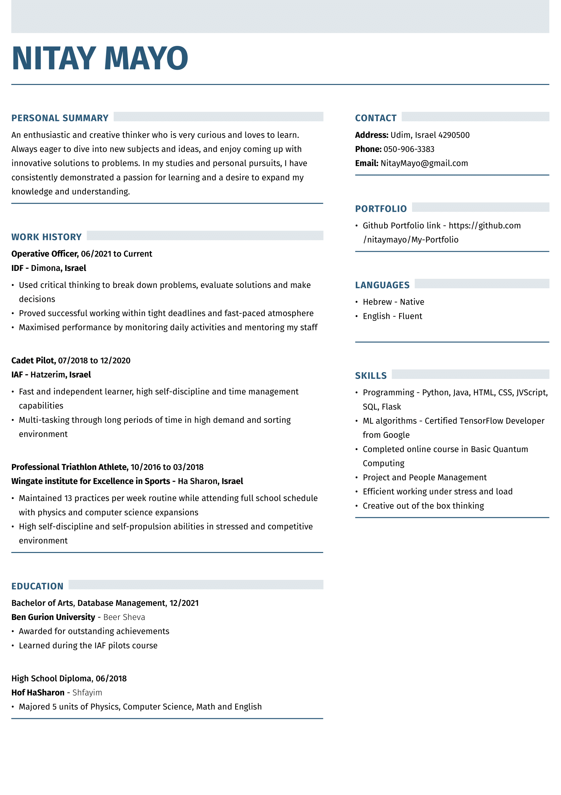

<h1>My Portfolio</h1>

  My coding portfolio showcases a diverse range of projects utilizing various programming languages and frameworks 
  such as Python, Java, HTML, CSS, JavaScript, SQL and TensorFlow.

  From web development projects utilizing HTML, CSS and JavaScript to data analysis projects utilizing SQL and Python, 
  this demonstrate my ability to work with a variety of technologies. Additionally, I have experience in building machine 
  learning models using TensorFlow. Overall, my portfolio showcases my ability to work with different technologies and 
  my passion for coding.

  
<h2>My Resume</h2>

